# LinkedIn Job Postings Knowledge Graph

This project involves working with a knowledge graph using an open dataset. The dataset used pertains to LinkedIn job postings in the year 2023. You can access the dataset via [this link](https://www.kaggle.com/datasets/arshkon/linkedin-job-postings) to understand its contents.

## Table of Contents

- [Usage](#usage)
- [1. Ontology](#1-ontology)
- [2. Python and Serialization](#2-python-and-serialization)
- [3. Queries](#3-queries)

## Usage

To utilize this project, follow the steps below:

### 1. Data Extraction

- Locate and extract the `LinkedinData.zip` file located in the main folder of this repository. This zip file contains the necessary data (also the .ttl files) for the project.

### 2. Notebook Execution

- Open the notebook file named `loadJobPosting.ipynb` located in the repository.
- Navigate to the "Project" section within the notebook.
- Execute each cell one by one to get the .ttl files.

By following these steps, you can efficiently work with the provided data for this project.

## 1. Ontology

In this project, We are developing an ontology related to LinkedIn Job Postings. The objective is to utilize Python along with the `rdflib` and `pandas` packages to convert the output to `.ttl` format for utilization within a graph database.

### Data Description:

For this purpose, the following CSV files are utilized, each containing distinct entities and their associations:

1. **job_posting.csv**
    - Columns: job_id, company_id, title, description, max_salary, med_salary, min_salary, pay_period, location, applies, original_listed_time, remote_allowed, views, job_posting_url, application_url, application_type, expiry, closed_time, formatted_experience_level, skills_desc, listed_time, posting_domain, sponsored, work_type, currency, compensation_type

2. **companies.csv**
    - Columns: company_id, name, description, company_size, state, country, city, zip_code, address, url
    - Classification based on `company_size`:
        - 1 or 2: Small company (subclass of company)
        - 3-5: Medium company (subclass of company)
        - 6 or 7: Large company (subclass of company)

3. **industries.csv**
    - Columns: industry_id, industry_name

4. **skills.csv**
    - Columns: skill_abr, skill_name

5. **benefits.csv**
    - Columns: benefit_id, job_id, inferred, type

6. **salaries.csv**
    - Columns: salary_id, job_id, max_salary, med_salary, min_salary, pay_period, currency, compensation_type

7. **specialities.csv**
    - Columns: speciality_id, speciality

Additionally, the relational structure between classes is established through the following files:

8. **company_industries.csv**
9. **company_specialities.csv**
10. **job_industries.csv**
11. **job_skills.csv**

An extra file, **12-employee_counts.csv**, contains information regarding each company:
- Columns: company_record_id, company_id, employee_count, follower_count, time_recorded
- Classification based on `follower_count`:
    - More than "201083": High follower company
    - Less than "201083": Low follower company

### Node Relations:

The object properties (relations) between nodes are outlined as follows:

1. A Job posting has a company, annotated by the term "hasCompany."
2. A Job posting has one or more skills, annotated by the term "hasSkill."
3. A Job posting has one or more industries associated, annotated by the term "hasIndustryType."
4. A Company has a country, annotated by the term "hasCountry."
5. A company has one or more industries associated, annotated by the term "hasIndustry."
6. The employee_count table records companies and is associated with a company, annotated by the term "IsForCompany."
7. A Benefit is for a specific Job posting, annotated by the term "isForJobPosting."
8. A company has one or more specialties associated with it, annotated by the term "hasSpeciality."
9. A Salary is for a specific job posting, annotated with "isAllocatedFor."

### Ontology File:

The repository includes the ontology file [Linkedin_Ontology.rdf](linkedin_ontology.rdf) implemented using Protege. For visualization, [gra.fo](images/ontology.jpeg) is utilized to provide an understanding of the underlying structure.

## 2. Python and Serialization

Python, renowned for its versatility and extensive libraries, was the chosen language for this project due to its flexibility and robustness in handling data. Specifically, the `rdflib` package within Python was instrumental in constructing triples (subject, predicate, object) that form the foundation of the entire graph.

### Utilization of Python and rdflib:

By leveraging Python and the `rdflib` package, we crafted triples to represent entities and relationships within the knowledge graph. This process allowed us to intricately define and interlink the various nodes (subjects) and their properties (predicates and objects), establishing a comprehensive graph structure.

### Data Cleaning for Robustness:

Prior to the serialization and generation of triples, rigorous data cleaning procedures were implemented. These included but were not limited to:

- Removal of extraneous white spaces

- Deletion of non-textual elements such as emojis

- Removal of unnecessary columns in our data

- Deletion of dashes(-) and dots(.) from some columns

The objective behind this meticulous cleaning was to enhance the robustness and integrity of the dataset, ensuring its readiness for effective querying and analysis within the knowledge graph.

### Serialization to `.ttl` (Turtle) Format:

Upon generating these triples from the refined dataset, the resultant graph was serialized, transforming the interconnected data into a structured and semantically rich format. Serialization was achieved through the `rdflib` library, culminating in the creation of a `.ttl` (Turtle) file. This format adheres to the RDF (Resource Description Framework) standards, enabling easy comprehension and utilization within graph databases or semantic web applications.

## 3. Queries

This section provides details of the queries performed on the LinkedIn Job Postings Knowledge Graph, including descriptions, query code, query results, and visualization charts.

### Query Descriptions

1. **Query 1**: Names of companies providing either vision or dental insurance for job postings, excluding those situated in the United States.

   - SPARQL Query: `query1.txt`
   - Query Result: 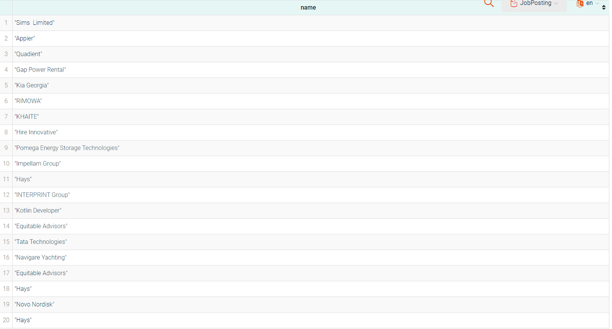

2. **Query 2**: Do we have a large company in Great Britain (gb) with an hourly average salary more than 10 dollars?

   - SPARQL Query: `query2.txt`
   - Query Result: 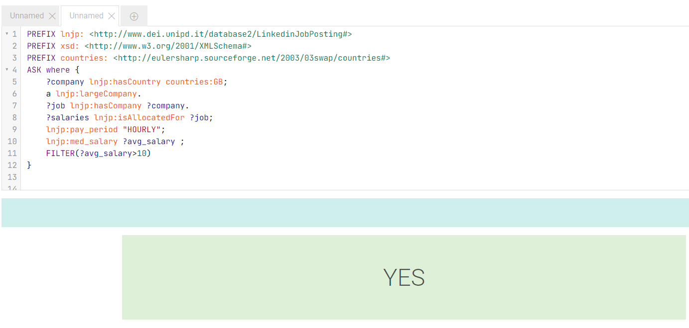

3. **Query 3**: Return remote allowed job titles with low followers and employee count more than 6000 recorded in August 2023.

   - SPARQL Query: `query3.txt`
   - Query Result: 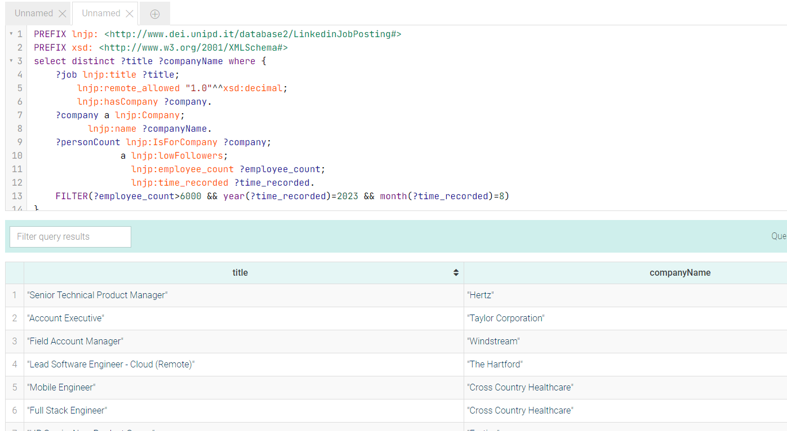

4. **Query 4**: List of companies with max number of employee in each industry in US

   - SPARQL Query: `query4.txt`
   - Query Result: 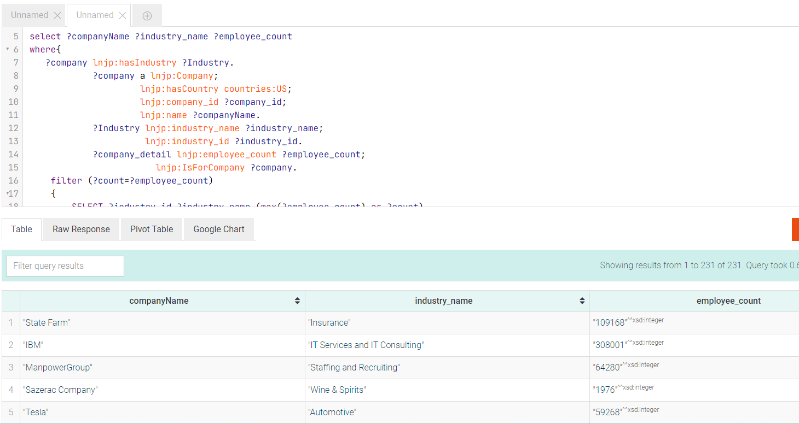

5. **Query 5**: Retrieve companies and their countries where the total employee count is greater than the average employee count for companies with high follower counts.

   - SPARQL Query: `query5.txt`
   - Query Result: 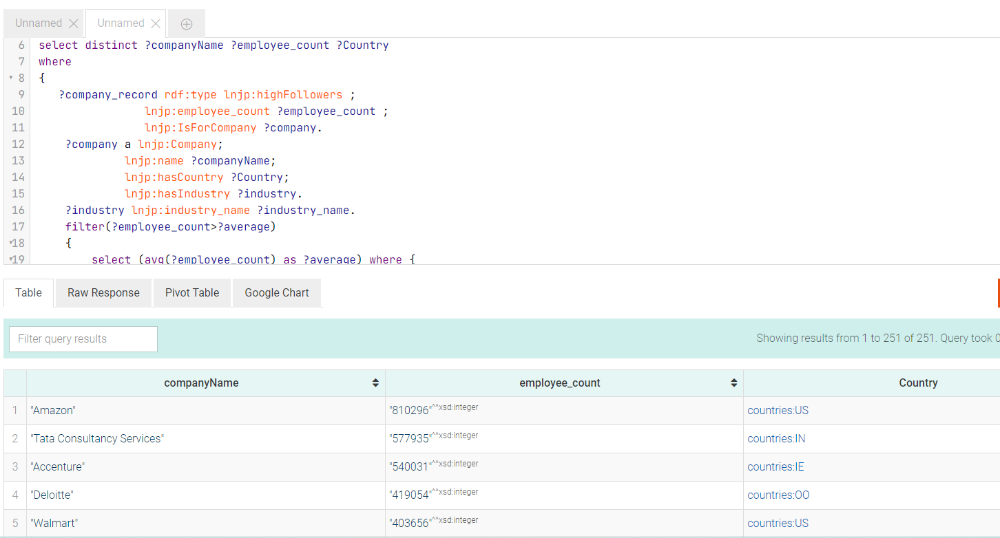
   - Visualization Chart(s): 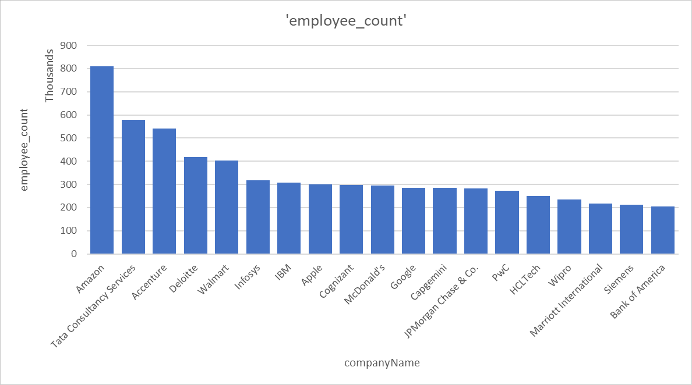, 

6. **Query 6**: Retrieve companies, their countries, and the count of job postings that require more than 3 skills.

   - SPARQL Query: `query6.txt`
   - Query Result: 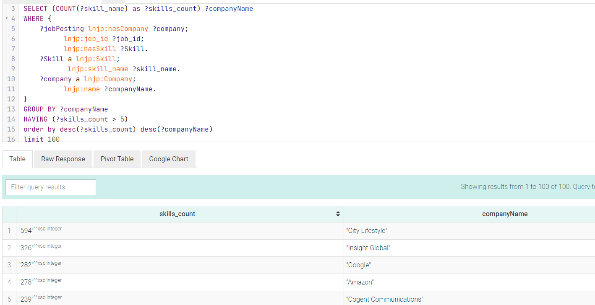
   - Visualization Chart(s): 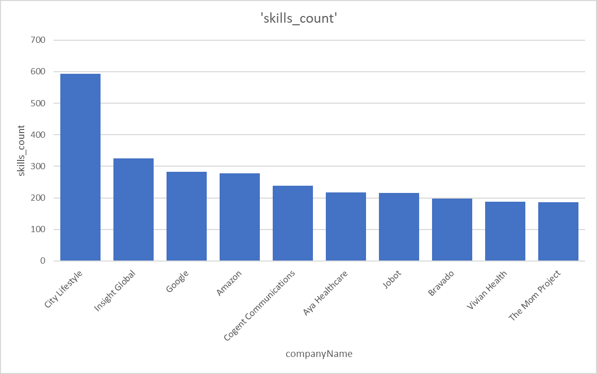, 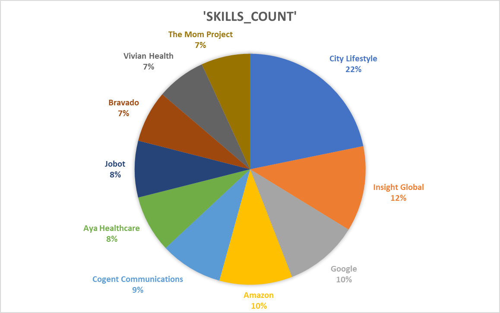
   
7. **Query 7**: Checks whether there were more job postings in November 2023 than in August 2023 for positions related to engineering within companies across different countries

   - SPARQL Query: `query7.txt`
   - Query Result: 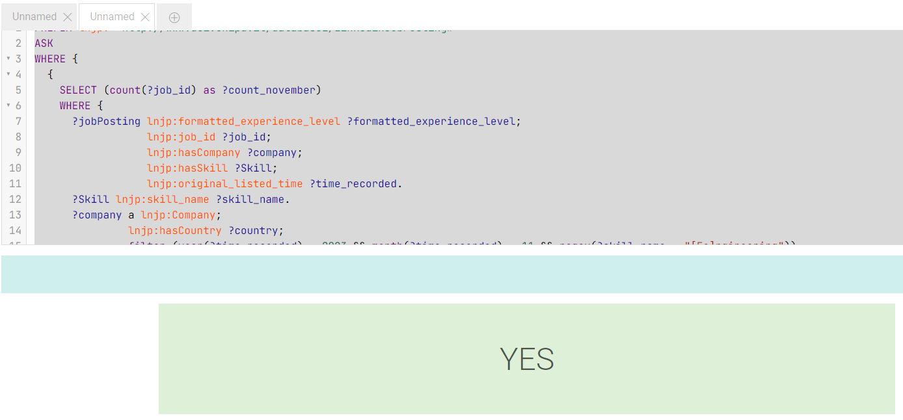

8. **Query 8**: List of the top 10 skills based on the count of job postings in 2023

   - SPARQL Query: `query8.txt`
   - Query Result: 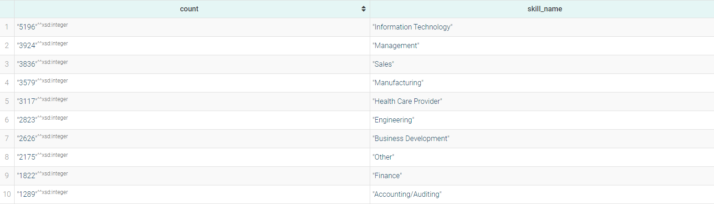
   - Visualization Chart(s): 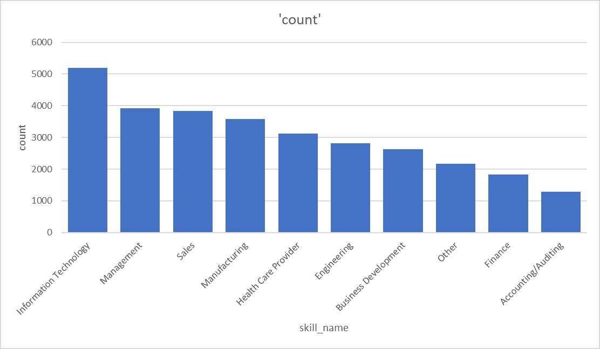

9. **Query 9**: List of job posting in the IT field by Google and Amazon in 2023

   - SPARQL Query: `query9.txt`
   - Query Result: 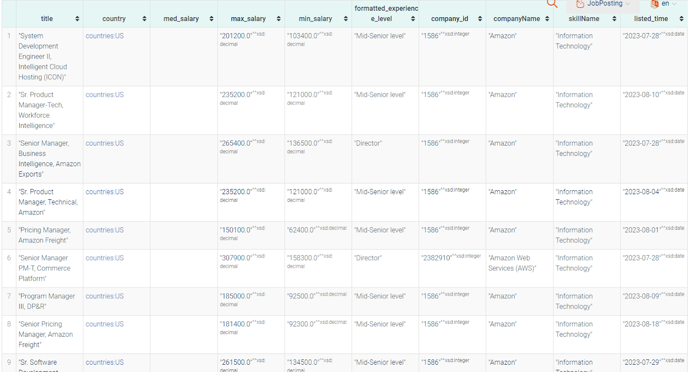

10. **Query 10**: Number of job postings of each experience_level and industry with a count exceeding 500.

   - SPARQL Query: `query10.txt`
   - Query Result: 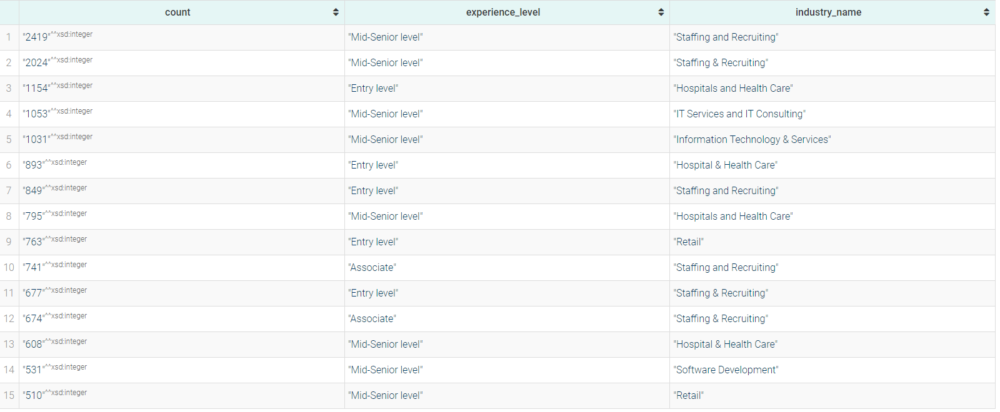
   - Visualization Chart(s): 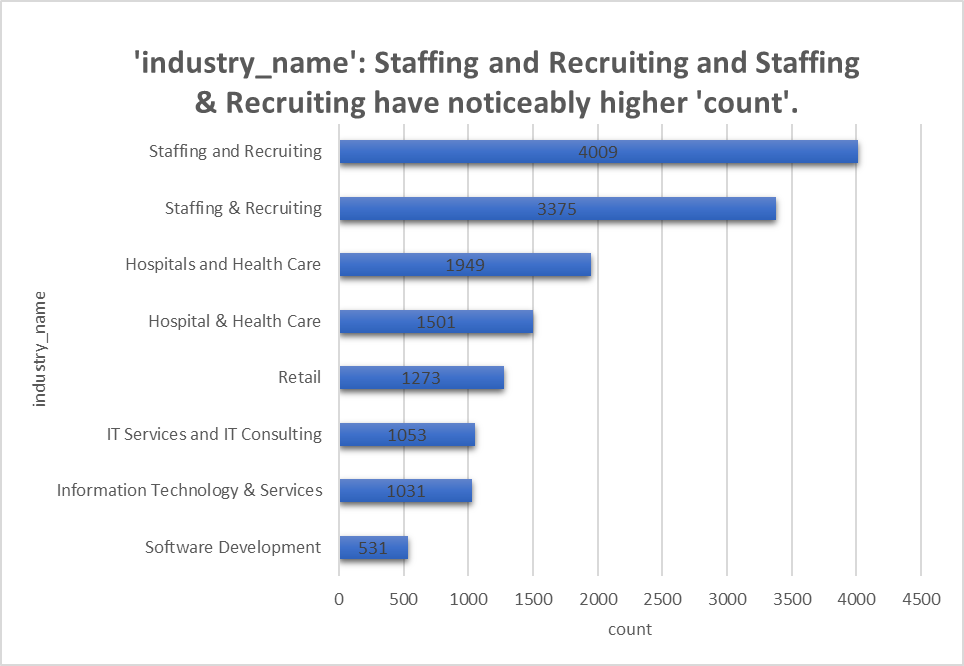, 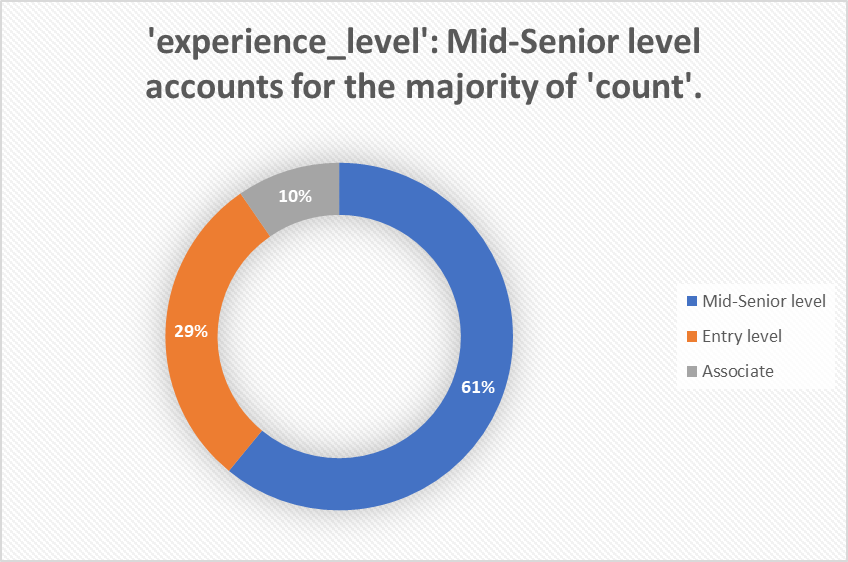
